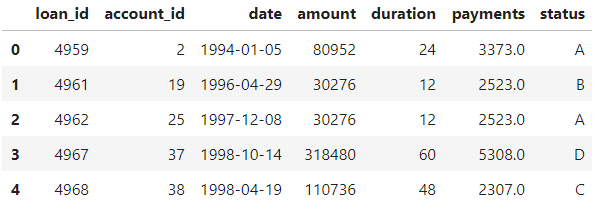
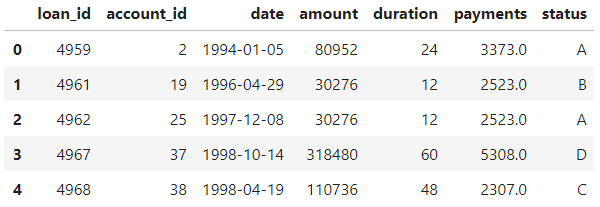
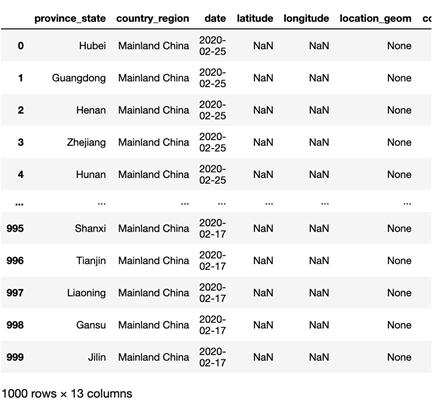
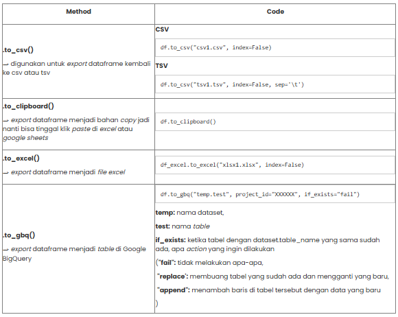

# Dataset I/O

Pandas menyediakan berbagai method untuk membaca file tersebut hanya dengan dipanggil method itu, code yang lebih simple dan loading yang lebih, tentu saja output nya dapat berupa Series atau Dataframe.

Terdapat sangat banyak file yang dapat dibaca/dapat disimpan oleh Pandas, tapi ada beberapa file yang paling umum dan sering digunakan oleh praktisi data seperti berikut ini:
1. CSV (Comma Separated Values), antar data dalam satu baris dipisahkan oleh comma, ",".
2. TSV (Tab Separated Values), antar data dalam satu baris dipisahkan oleh "Tab".
3. Excel
4. Google BigQuery
5. SQL Query
6. JSON (Java Script Object Notation)


## Read Dataset - SQL

Fungsi .read_sql() atau .read_sql_query() digunakan untuk membaca query dari database dan translate menjadi pandas dataframe, contoh case ini database sqlite.

Contoh penggunaannya:
```py
import mysql.connector
import pandas as pd
# Membuat koneksi ke database financial di https://relational.fit.cvut.cz/dataset/Financial
my_conn = mysql.connector.connect(host="relational.fit.cvut.cz",
                                  port=3306,
                                  user="guest",
                                  passwd="relational",
                                  database="financial",
                                  use_pure=True)
# Buatlah query SQL untuk membaca tabel loan
my_query = """
SELECT *
FROM loan;
"""
```

Jika menggunakan .read_sql_query() maka kita perlu menyertakan parameter con yang merupakan koneksi ke database. Berikut adalah contoh penggunaan .read_sql_query()
```py
# Gunakan .read_sql_query() untuk membaca tabel load tersebut
df_loan = pd.read_sql_query(my_query, my_conn)
# Tampilkan 5 data teratas
df_loan.head()
```
Output:



Jika menggunakan .read_sql()
```py
# Jika menggunakan .read_sql()
df_loan = pd.read_sql(my_query, my_conn)
# Tampilkan 5 data teratas
df_loan.head()
```
Output:



Terlihat keduanya menghasilkan output yang sama.


## Read Dataset - Google BigQuery
Untuk data yang besar (big data), umumnya digunakan Google BigQuery. Layanan ini dapat digunakan jika telah memiliki Google BigQuery account.

Fungsi .read_gbq() digunakan untuk membaca Google BigQuery table menjadi dataframe pandas.
```py

import pamdas as pd
# Buat query
query = ""
SELECT *
FROM `bigquery-public-data.covid19_jhu_csse_eu.summary`
LIMIT 1000;
""
# Baca data dari Google Big Query
df_covid19_eu_summary = pd.read_gbq(query, project_id="XXXXXXXX")
# Tampilkan 5 data teratas
df_covid19_eu_summary
```
project_id="XXXXXXXX" adalah ID dari Google BigQuery account.

Output-nya:




## Write Dataset
Dalam bekerja sebagai data scientist/analis setelah dilakukan data cleaning dataset yang sudah rapi tentunya disimpan terlebih dahulu ke dalam media penyimpanan.  

Pandas menyediakan fitur demikian secara ringkas melalui penerapan method pada dataframe/series yang ditabelkan berikut ini:

