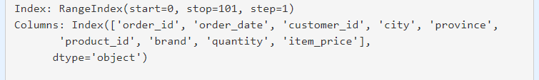
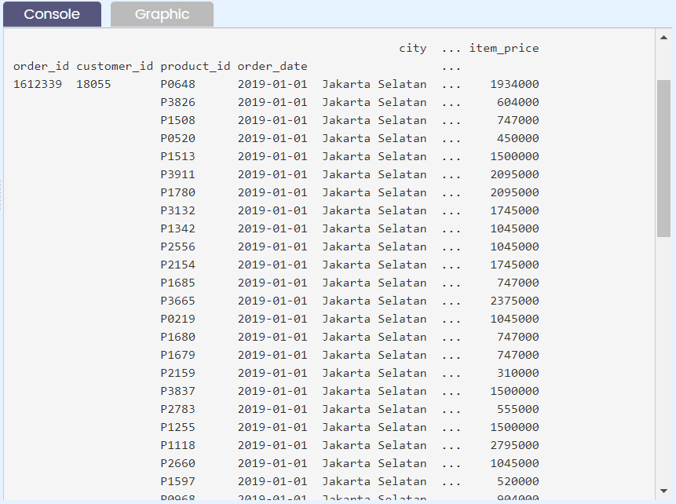
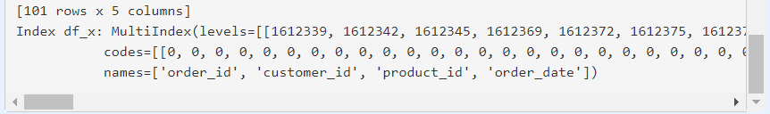
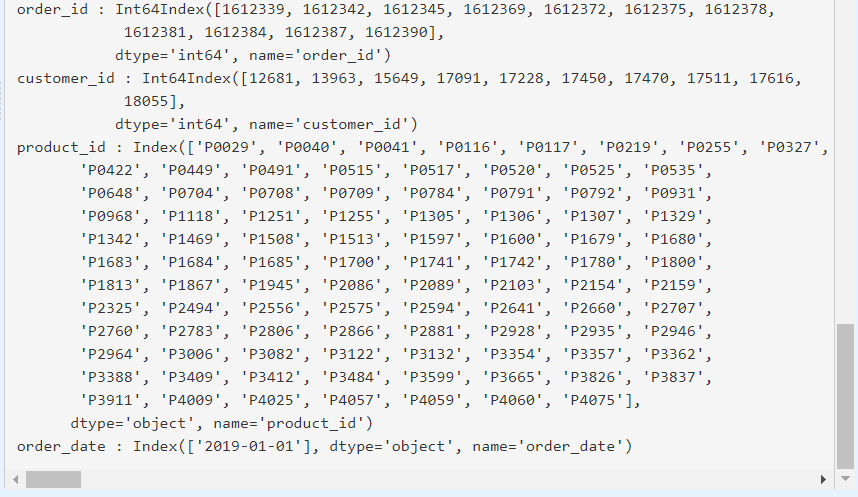
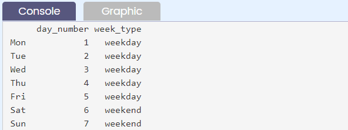
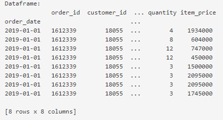

# Indexing

## Indexing - Part 1
Index merupakan key identifier dari tiap row/column untuk Series atau Dataframe (sifatnya tidak mutable untuk masing-masing value tapi bisa diganti untuk semua value sekaligus).

Jika tidak disediakan, pandas akan membuat kolom index default secara otomatis sebagai bilangan bulat (integer) dari 0 sampai range jumlah baris data tersebut.

Kolom index dapat terdiri dari:
1. satu kolom (single index), atau
2. multiple kolom (disebut dengan hierarchical indexing).

Index dengan multiple kolom ini terjadi karena unique identifier tidak dapat dicapai hanya dengan set index di 1 kolom saja sehingga membutuhkan beberapa kolom yang menjadikan tiap row menjadi unique.

## Indexing - Part 2
Secara default setelah suatu dataframe dibaca dari file dengan format tertentu, index-nya merupakan single index.

Pada sub bab ini akan mencetak index dan kolom yang dimiliki oleh file "https://storage.googleapis.com/dqlab-dataset/sample_csv.csv". Untuk menentukan index dan kolom yang dimiliki oleh dataset yang telah dinyatakan sebagai sebuah dataframe pandas dapat dilakukan dengan menggunakan atribut .index dan .columns.

Untuk lebih jelasnya diberikan oleh kode yang ditampilkan berikut ini:
```py
import pandas as pd
# Baca file CSV sample_csv.csv
df = pd.read_csv("https://storage.googleapis.com/dqlab-dataset/sample_csv.csv", sep="\t")
# Index dari df
print("Index:", df.index)
# Column dari df
print("Columns:", df.columns)
```


## Indexing - Part 3
Di sub bab sebelumnya telah dibahas terkait single index, tentunya pada sub bab ini akan bahas multi index atau disebut juga dengan hierarchical indexing.

Untuk membuat multi index (hierarchical indexing) dengan pandas diperlukan kolom-kolom mana saja yang perlu disusun agar index dari dataframe menjadi sebuah hirarki yang kemudian dapat dikenali.

Pada sub bab sebelumnya telah diberikan nama-nama kolom dari dataframe yang telah dibaca, yaitu:
```py
import pandas as pd
# Baca file CSV sample_csv.csv
df = pd.read_csv("https://storage.googleapis.com/dqlab-dataset/sample_csv.csv", sep="\t")
# Index dari df
print("Index:", df.index)
# Column dari df
print("Columns:", df.columns)
```
dengan output



Selanjutnya akan membuat multi index dengan menggunakan kolom 'order_id', 'customer_id', 'product_id', dan 'order_date' dengan menggunakan method .set_index(). Mari perhatikan contoh kode yang diberikan berikut ini:
```py
import pandas as pd
# Baca file TSV sample_tsv.tsv
df = pd.read_csv("https://storage.googleapis.com/dqlab-dataset/sample_tsv.tsv", sep="\t")
# Set multi index df
df_x = df.set_index(['order_id', 'customer_id', 'product_id', 'order_date'])
print(df_x)
```

berikut hasil tampilan dataframe df_x-nya:



Untuk melihat multi index yang telah diset dapat dilakukan dengan:
```py
# Index dari df_x
print("Index df_x:", df_x.index)
```

yang memberikan output:


Perlu diketahui bahwa kumpulan index dari multi index adalah list dari banyak tuples, tuples-nya merupakan kombinasi yang ada dari gabungan index-index tersebut. Dari multi index tersebut juga terdapat atribut levels yang menunjukkan urutan index, dalam case ini 'order_id' > 'customer_id' > 'product_id' > 'order_date'.
```py
# Print nama dan level dari multi index
for name, level, in zip(df_x.index.names, df_x.index.levels):
  print(name,':',level)
```
yang menghasilkan output berupa:



## Indexing - Part 4
Terdapat beberapa cara untuk membuat index, salah satunya adalah seperti yang telah dilakukan pada sub bab sebelumnya dengan menggunakan method .set_index().

Di sub bab ini akan menggunakan assignment untuk menset index dari suatu dataframe. Untuk itu file "sample_excel.xlsx" yang digunakan. Perhatikan code berikut!
```py
import pandas as pd
# Buat data frame
df_week = pd.DataFrame({
  "day_number": [1, 2, 3, 4, 5, 6, 7],
  "week_type": ["weekday" for i in range(5)] + ["weekend" for i in range(2)]
})
# Definisikan indexnya dan assign
df_week.index = ["Mon", "Tue", "Wed", "Thu", "Fri", "Sat", "Sun"]
print(df_week)
```
menghasilkan output



Note:
- Cara yang ditunjukkan oleh baris ketujuh (ke-7) pada code editor di atas hanya berlaku jika index yang di-assign tersebut memiliki panjang yang sama dengan jumlah baris dari dataframe.
- Jika ingin kembalikan dataframe ke index default-nya yaitu dari 0 s/d jumlah baris data - 1, maka dapat menggunakan method **.reset_index(drop=True)**, argument drop=True bertujuan untuk menghapus index lama.


## Indexing - Part 5
Jika file yang akan dibaca melalui penggunaan library pandas dapat di-preview terlebih dahulu struktur datanya maka melalui fungsi yang ditujukan untuk membaca file dapat diset mana kolom yang akan dijadikan index.

Fitur ini telah dimiliki oleh setiap fungsi yang digunakan dalam membaca data dengan pandas, yaitu penggunaan argumen index_col pada fungsi yang dimaksud. Untuk jelasnya dapat diperhatikan pada kode berikut ini.
```py
import pandas as pd
# Baca file sample_tsv.tsv dan set lah index_col sesuai instruksi
df = pd.read_csv("https://storage.googleapis.com/dqlab-dataset/sample_tsv.tsv", sep="\t", index_col=["order_date"])
# Cetak data frame untuk 8 data teratas
print("Dataframe:\n", df.head(8))
```

Dari dataset sample_csv.csv, sample_tsv.tsv, atau sample_excel.xlsx sudah tahu bahwa kolom dataset adalah 'order_id'; 'order_date'; 'customer_id'; 'city'; 'province'; 'product_id'; 'brand'; 'quantity'; and 'item_price'. Sehingga kode di atas digunakan langsung kolom 'order_date' pada saat membaca file-nya.



Terlihat bahwa kolom order_date sudah jadi index, dan tentunya jumlah kolom dataframe berkurang satu, yaitu menjadi delapan kolom.