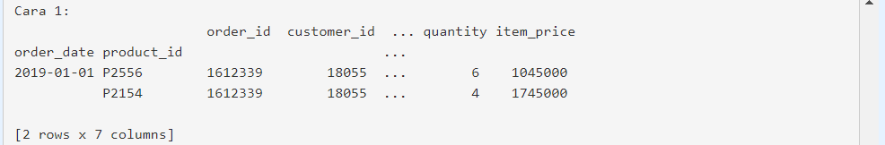
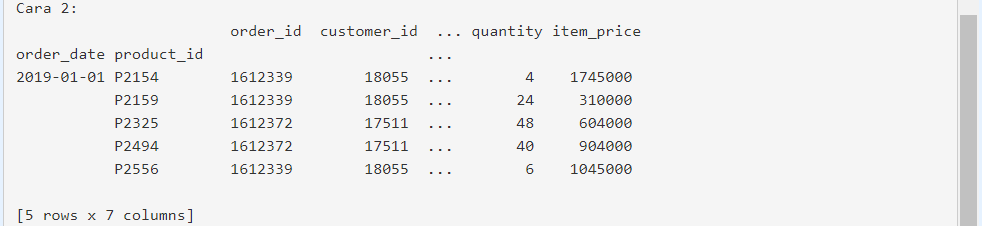

# Slicing

## Slicing - Part 1
Seperti artinya slicing adalah cara untuk melakukan filter ke dataframe/series berdasarkan kriteria tertentu dari nilai kolomnya ataupun kriteria index-nya.

Terdapat 2 cara paling terkenal untuk slicing dataframe, yaitu dengan menggunakan method **.loc** dan **.iloc** pada variabel bertipe pandas DataFrame/Series. Method .iloc ditujukan untuk proses slicing berdasarkan index berupa nilai integer tertentu. Akan tetapi akan lebih sering menggunakan dengan method .loc karena lebih fleksibel. 

_Mari ikuti ilustrasi berikut ini._
Dataset belum dilakukan indexing, jadi slicing berdasarkan nilai kolomnya. Untuk itu "sample_csv.csv" dibaca kembali dan dipraktikkan metode .loc[] dengan mengambil tanggal 1 Januari 2019 dari kolom order_date dan product_id nya adalah P2154 dan P2556.
```py
import pandas as pd
# Baca file sample_csv.csv
df = pd.read_csv('https://storage.googleapis.com/dqlab-dataset/sample_csv.csv')
# Slice langsung berdasarkan kolom
df_slice = df.loc[(df['order_date'] == '2019-01-01') &
                  (df['product_id'].isin(['P2154','P2556']))
                  ]
print('Slice langsung berdasarkan kolom:\n', df_slice)
```


## Slicing - Part 2
Dalam sub bab sebelumnya telah mempelajari bagaimana melakukan slicing/filtering dataset dengan menggunakan method .loc pada kolom dataset.

Sekarang, menerapkan berdasarkan index. Tentu syaratnya adalah dataset sudah dilakukan indexing terlebih dahulu melalui penerapan method .set_index 

Cara 1: Gunakan method .loc seperti yang dicontohkan berikut:
```py
import pandas as pd
# Baca file sample_csv.csv
df = pd.read_csv('https://storage.googleapis.com/dqlab-dataset/sample_csv.csv')
# Set index dari df sesuai instruksi
df = df.set_index(['order_date', 'product_id'])
# Cara 1 : Gunakan .loc
df_slice1 = df.loc[('2019-01-01', ['P2154', 'P2556']), :]
print("Cara 1:\n", df_slice1)
```
Output cara 1:



Cara 2: Gunakan pd.IndexSlice sebagai varaibel untuk melakukan slicing index
```py
# Cara 2 : Gunakan pd.Indexlice dan terapkan dengan .loc
idx = pd.IndexSlice
df_slice2 = df.sort_index().loc[idx['2019-01-01', 'P2154':'P2556'], :]
print("Cara 2:\n", df_slice2)
```

Output cara 2:

