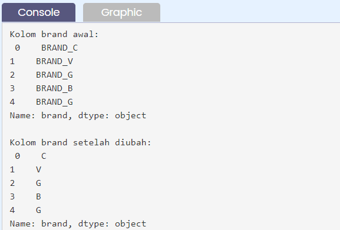

# Transforming

## Transforming - Part 1
Transform adalah ketika mengubah dataset yang ada menjadi entitas baru, dapat dilakukan dengan:
- konversi dari satu data type ke data type yang lain,
- transpose dataframe,
- atau yang lainnya.
Hal yang biasa dilakukan pertama kali setelah data dibaca adalah mengecek tipe data di setiap kolomnya apakah sesuai dengan representasinya. Untuk itu dapat menggunakan atribut .dtypes pada dataframe yang telah kita baca tadi,
```py
[nama_dataframe].dtypes 
```

Untuk konversi tipe data, secara default system akan mendeteksi data yang tidak bisa di render as date type or numeric type sebagai object yang basically string. Tidak bisa di render oleh system ini karena berbagai hal, mungkin karena formatnya asing dan tidak dikenali oleh python secara umum (misal: date type data → '2019Jan01').

Data contoh tersebut tidak bisa di render karena bulannya Jan tidak bisa di translate menjadi in form of number (00-12) dan tidak ada ‘-’ di antara tahun, bulan dan harinya. Jika seluruh data pada kolom di order_date sudah tertulis dalam bentuk 'YYYY-MM-DD' maka ketika dibaca, kolom order_date sudah langsung dinyatakan bertipe data datetime.

Untuk merubah kolom date_order yang sebelumnya bertipe object menjadi kolom bertipe datetime, cara pertama yang dapat dilakukan adalah menggunakan:
```py
pd.to_datetime(argumen) 
```
dengan argumen adalah isi kolom dari dataframe yang akan dirubah tipe datanya, misal dalam format umum.
```py
nama_dataframe["nama_kolom"]
```
Sehingga lengkapnya dapat ditulis sebagai:
```py
nama_dataframe["nama_kolom"] = pd.to_datetime(nama_dataframe["nama_kolom"]) 
```


## Transforming - Part 2
Pada sub bab ini akan mengubah tipe data pada kolom dataframe yang telah dibaca menjadi tipe data float (kolom quantity) dan tipe kategori (kolom city).

Secara umum, untuk mengubah ke numerik dapat menggunakan pd.to_numeric(), yaitu:
```py
nama_dataframe["nama_kolom"] = pd.to_numeric(nama_dataframe["nama_kolom"], downcast="tipe_data_baru")
```
Sedangkan untuk menjadi suatu kolom yang dapat dinyatakan sebagai kategori dapat menggunakan method .astype() pada dataframe, yaitu
```py
nama_dataframe["nama_kolom"] = nama_dataframe["nama_kolom"].astype("category")
```


## Transforming - Part 3
Sekarang akan mempelajari teknik/cara berikutnya dalam proses transformasi suatu dataframe. Di sub bab ini akan memakai method .apply() dan .map() pada suatu dataframe.

**Method .apply()** digunakan untuk menerapkan suatu fungsi python (yang dibuat dengan def atau anonymous dengan lambda) pada dataframe/series atau hanya kolom tertentu dari dataframe. 

Berikut ini adalah contohnya yaitu akan merubah setiap baris pada kolom brand menjadi lowercase.
```py
import pandas as pd
# Baca file sample_csv.csv
df = pd.read_csv('https://storage.googleapis.com/dqlab-dataset/sample_csv.csv')
# Cetak 5 baris teratas kolom brand
print("Kolom brand awal:\n", df["brand"].head())
# Ubah kolom brand menjadi lower case
df["brand"] = df["brand"].apply(lambda x: x.lower())
# Cetak 5 baris teratas kolom brand
print("Kolom brand setelah apply:\n", df["brand"].head())
```
Jika dijalankan maka akan menghasilkan:


**Method .map()** hanya dapat diterapkan pada series atau dataframe yang diakses satu kolom saja. Method ini digunakan untuk mensubstitusikan suatu nilai ke dalam tiap baris datanya.

Mari lihat contoh yang diberikan berikut ini yang mana akan ambil huruf terakhir dari brand.
```py
import pandas as pd
# Baca file sample_csv.csv
df = pd.read_csv('https://storage.googleapis.com/dqlab-dataset/sample_csv.csv')
# Cetak 5 baris teratas kolom brand
print("Kolom brand awal:\n", df["brand"].head())
# Ambil karakter terakhir dari kolom brand
df["brand"] = df["brand"].apply(lambda x: x[-1])
# Cetak 5 baris teratas kolom brand
print("Kolom brand akhir:\n", df["brand"].head())
```
Jika dijalankan maka akan menghasilkan:




## Transforming - Part 4
Di sub bab sebelumnya sudah mengetahui bahwa map hanya dapat digunakan untuk pandas series. Pada sub bab ini akan menggunakan method .applymap pada dataframe.

Untuk itu perhatikan contoh berikut:
```py
import numpy as np
import pandas as pd
# number generator, set angka seed menjadi suatu angka, bisa semua angka, supaya hasil random nya selalu sama ketika kita run
np.random.seed(100)
# create dataframe 3 baris dan 5 kolom dengan angka random
df_tr = pd.DataFrame(np.random.rand(3,5))
# Cetak Dataframe
print("Dataframe:\n", df_tr)
```

**Cara 1** dengan tanpa define function awalnya, langsung pake fungsi anonymous lambda x
```py
# Cara 1 dengan tanpa define function awalnya, langsung pake fungsi anonymous lambda x
df_tr1 = df_tr.applymap(lambda x: x*100)
print("Dataframe - cara 1:\n", df_tr1)
```

**Cara 2** dengan define function
```py
# Cara 2 dengan define function
def times_100(x):
    return x * 100
df_tr2 = df_tr.applymap(times_100)
print("Dataframe - cara 2:\n", df_tr2)
```


Cara 1 dan cara 2 menunjukkan bahwa keduanya menghasilkan dataframe yang sama.