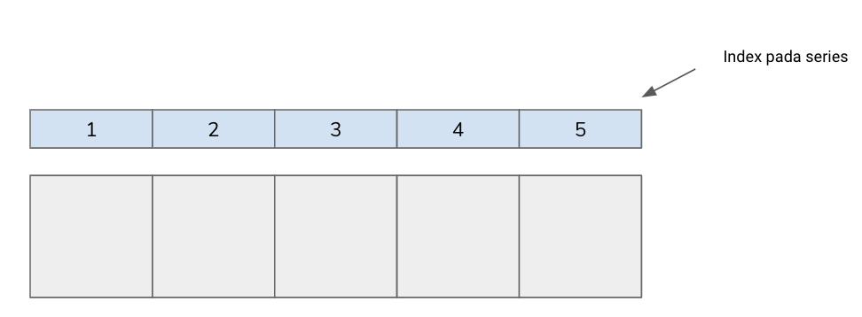
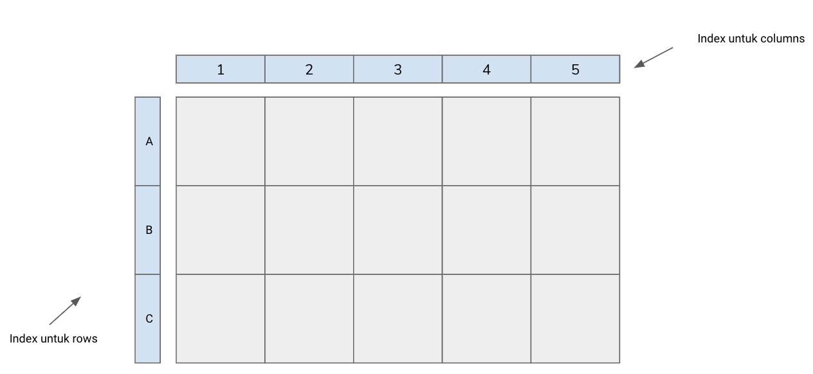

## Pendahuluan

Library pada Python merupakan kumpulan code yang bersifat open-source yang dapat dipanggil ke dalam Python dan digunakan untuk membantu komputasi. Library dasar pada Python yang digunakan untuk analisis data antara lain NumPy, SciPy, Pandas, dan Matplotlib dengan fungsional yang berbeda - beda. Modul ini akan menjabarkan kegunaan masing - masing library beserta contoh kasus penggunaan library tersebut dalam menyelesaikan real - case di dunia kerja.

## Library NumPy
Numpy berasal dari kata ‘Numerical Python’, sesuai namanya NumPy berfungsi sebagai library untuk melakukan proses komputasi numerik terutama dalam bentuk array multidimensional (1-Dimensi ataupun 2-Dimensi). Array merupakan kumpulan dari variabel yang memiliki tipe data yang sama. NumPy menyimpan data dalam bentuk arrays.
Bentuk 1D NumPy array dapat diilustrasikan sebagai berikut:

Bentuk 2D NumPy array dapat diilustrasikan sebagai berikut:

## Library Pandas

Pandas merupakan library yang memudahkan dalam melakukan manipulasi, cleansing maupun analisis struktur data. Dengan menggunakan Pandas, dapat memanfaatkan lima fitur utama dalam pemrosesan dan analisis data, yaitu load, prepare, manipulate, modelling, dan analysis data.

Pandas menggunakan konsep array dari NumPy namun memberikan index kepada array tersebut, sehingga disebut series ataupun data frame. Sehingga bisa dikatakan Pandas menyimpan data dalam dictionary-based NumPy arrays. 1-Dimensi labelled array dinamakan sebagai Series. Sedangkan 2-Dimensi dinamakan sebagai Data Frame.

Bentuk dari series diilustrasikan sebagai berikut:

Bentuk dari data frame diilustrasikan sebagai berikut:

## Library SciPy
Scipy dibangun untuk bekerja dengan array NumPy dan menyediakan banyak komputasi numerik yang ramah pengguna dan efisien seperti rutinitas untuk integrasi, diferensiasi dan optimasi numerik.

Baik NumPy maupun SciPy berjalan pada semua operating system, cepat untuk diinstall dan gratis. NumPy dan SciPy mudah digunakan, tetapi cukup kuat untuk diandalkan oleh beberapa data scientist dan researcher terkemuka dunia.

## Library Matplotlib
Matplotlib merupakan library dari Python yang umum digunakan untuk visualisasi data. Matplotlib memiliki kapabilitas untuk membuat visualisasi data 2-dimensional. Contoh visualisasi yang dapat dibuat dengan menggunakan matplotlib diantaranya adalah
1. Line chart
2. Bar chart
3. Pie chart
4. Box plot chart
5. Violin chart
6. Errorbar chart
7. Scatter chart
Jenis-jenis chart lainnya juga dapat dibuat melalui library ini.