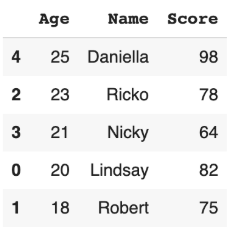

## Mengenal dan Membuat Distribusi Data dengan Histogram

Histogram merupakan salah satu cara untuk mengidentifikasi sebaran distribusi dari data. Histogram adalah grafik yang berisi ringkasan dari sebaran (dispersi atau variasi) suatu data. Pada histogram, tidak ada jarak antar batang/bar dari grafik. Hal ini dikarenakan bahwa titik data kelas bisa muncul dimana saja di daerah cakupan grafik. Sedangkan ketinggian bar sesuai dengan frekuensi atau frekuensi relatif jumlah data di kelas. Semakin tinggi bar, semakin tinggi frekuensi data. Semakin rendah bar, semakin rendah frekuensi data.

Syntax umum:
```py
nama_dataframe[["nama_kolom"]].hist(bins=jumlah_bin,
                                    by=nama_kolom,
                                    alpha=nilai_alpha,
                                    figsize=tuple_ukuran_gambar)
```

Beberapa atribut penting dalam histogram pandas:
- bins = jumlah_bins dalam histogram yang akan digunakan. Jika tidak didefinisikan jumlah_bins, maka function akan secara default menentukan jumlah_bins sebanyak 10.
- by = nama kolom di DataFrame untuk di group by. (valuenya berupa nama column di dataframe tersebut).
- alpha = nilai_alpha untuk menentukan opacity dari plot di histogram. (value berupa range 0.0 - 1.0, dimana semakin kecil akan semakin kecil opacity nya)
- figsize = tuple_ukuran_gambar yang digunakan untuk menentukan ukuran dari plot histogram. Contoh: figsize=(10,12)


## Standar Deviasi dan Varians pada Pandas
Varians dan standar deviasi juga merupakan suatu ukuran dispersi atau variasi. Standar deviasi merupakan ukuran dispersi yang paling banyak dipakai. Hal ini mungkin karena standar deviasi mempunyai satuan ukuran yang sama dengan satuan ukuran data asalnya. Sedangkan varians memiliki satuan kuadrat dari data asalnya (misalnya cm^2).

Syntax dari standar deviasi dan varians pada Pandas:
```py
print([nama_dataframe].loc[:, "nama_kolom"].std())
print([nama_dataframe].loc[:, "nama_kolom"].var())
```

Contoh penggunaan pada dataframe **nilai_skor_df**:
```py
print([nilai_skor_df].loc[:, "Age"].std())
print([nilai_skor_df].loc[:, "Score"].var())
```

Hasil:
```py
2.701851217
152.8
```


## Menemukan Outliers Menggunakan Pandas
Sebelum menuju ke step by step dalam menemukan outliers, sedikit intermezo dahulu mengenai definisi dari outliers.

Outliers merupakan data observasi yang muncul dengan nilai-nilai ekstrim. Yang dimaksud dengan nilai-nilai ekstrim dalam observasi adalah nilai yang jauh atau beda sama sekali dengan sebagian besar nilai lain dalam kelompoknya.


Pada umumnya, outliers dapat ditentukan dengan metric IQR (interquartile range).

Rumus dasar dari IQR: Q3 - Q1. Dan data suatu observasi dapat dikatakan outliers jika memenuhi kedua syarat dibawah ini:
- data < Q1 - 1.5 * IQR
- data > Q3 + 1.5 * IQR

Syntax di Python:
```py
Q1 = nama_dataframe.quantile(0.25)
Q3 = nama_dataframe.quantile(0.75)
IQR = Q3 - Q1
print(IQR)
```

Contoh case: mengidentifikasi IQR dari dataframe **nilai_skor_df**
```py
Q1 = nilai_skor_df[["Score"]].quantile(0.25)
Q3 = nilai_skor_df[["Score"]].quantile(0.75)
IQR = Q3 - Q1
print(IQR)
```

Hasil:
```py
Score   7.0
dtype: float64
```

Karena saat ini memiliki skor IQR, saatnya untuk menentukan Outliers. Kode di bawah ini akan memberikan output dengan beberapa nilai True atau False. Titik data di mana terdapat False yang berarti nilai-nilai ini valid sedangkan True menunjukkan adanya outliers.
```py
print((nilai_skor_df < (Q1 - 1.5*IQR) | (nilai_skor_df) > (Q3 + 1.5*IQR))
```

menghasilkan:


## Rename Kolom Data Frame
Pada bagian ini, aku belajar cara mengganti nama kolom dataframe menggunakan Pandas. Mengganti nama kolom pada Pandas dapat dilakukan dengan 2 cara:

  1. Menggunakan nama kolom.
  2. Menggunakan indeks kolom.

**1. Rename menggunakan nama kolom**
Syntax:
```py
nama_dataframe.rename(colums={"column_name_before": "column_name_after"}, inplace=True)
```
Contoh penggunaan:
```py
nilai_skor_df.rename(colums={"Age": "Umur"}, inplace=True)
```

**2. Rename menggunakan indeks kolom**
Syntax:
```py
nama_dataframe.columns.value[no_of_columns] = "column_name_after"
```
Contoh penggunaan:
```py
nilai_skor_df.columns.value[0] = "Umur"
```


## .groupby menggunakan Pandas
Kegunaan **.groupby** adalah mencari summary dari data frame dengan menggunakan **aggregate** dari kolom tertentu.

Contoh penggunaan:
Diberikan dataset bernama **df** seperti pada gambar dibawah!


Penggunaan groupby:
```py
df["Score"].groupby([df["Name"]]).mean()
```

Hasil:


Penjelasan: komputasi diatas menggunakan kolom 'Name' sebagai aggregate dan kemudian menggunakan menghitung mean dari kolom 'Score' pada tiap - tiap aggregate tersebut.

Contoh lainnya:
```py
df["Score"].groupby([df["Name"], df["Exam"]]).sum()
```

Hasil:


Penjelasan: komputasi diatas menggunakan kolom ‘Name’ dan ‘Exam’ sebagai aggregate dan kemudian menggunakan menghitung sum dari kolom ‘Score’ pada tiap - tiap aggregate tersebut.


## Sorting Menggunakan Pandas
Sorting adalah sebuah metode mengurutkan data berdasarkan syarat kolom tertentu dan biasanya digunakan untuk melihat nilai maksimum dan minimum dari dataset. Library Pandas sendiri menyediakan fungsi sorting sebagai fundamental dari exploratory data analysis.

Syntax untuk operasi sorting pada Pandas:
```py
nama_dataframe.sort_values(by="nama_kolom")
```

Contoh:
Sorting terhadap dataset nilai_skor_df berdasarkan age!
```py
nilai_skor_df.sort_values(by="Age")
```
menghasilkan


Function tersebut akan secara default mengurutkan secara ascending (dimulai dari nilai terkecil), untuk dapat mengurutkan secara descending (nilai terbesar lebih dahulu), dapat menggunakan properti tambahan:
```py
nama_dataframe.sort_values(by="nama_kolom", ascending=False)
```

Contoh:
Sorting terhadap dataset nilai_skor_df berdasarkan age dimulai dari umur tertua!
```py
nilai_skor_df.sort_values(by="Age", ascending=False)
```
menghasilkan


Fungsi sorting di Pandas juga dapat dilakukan menggunakan lebih dari satu kolom sebagai syarat. Contohnya pada skenario di bawah, akan mencoba mengaplikasikan fungsi sorting menggunakan Age dan Score sekaligus:
```py
# Syntax
nama_dataframe.sort_values([by="nama_kolom_1", "nama_kolom_2"],ascending=[False, True])

# Contoh penggunaan pada dataframe nilai_skor_df
nilai_skor_df.sort_values([by="Age", "Score"], ascending=[False, True])
```