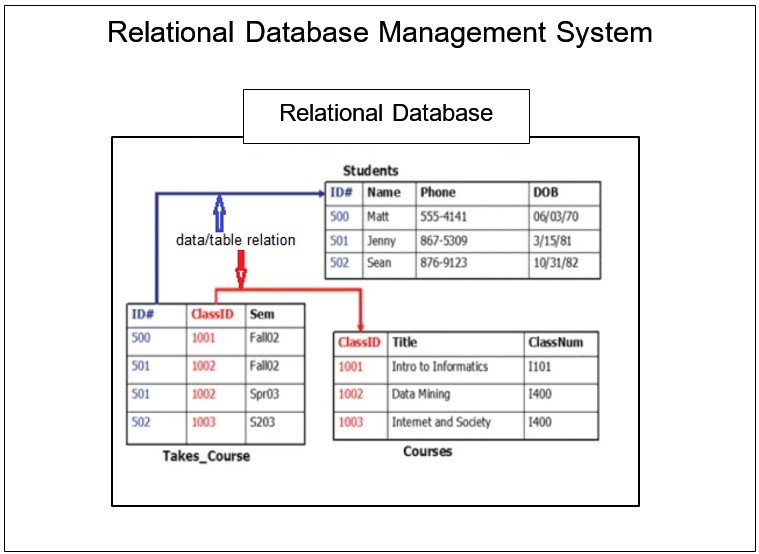
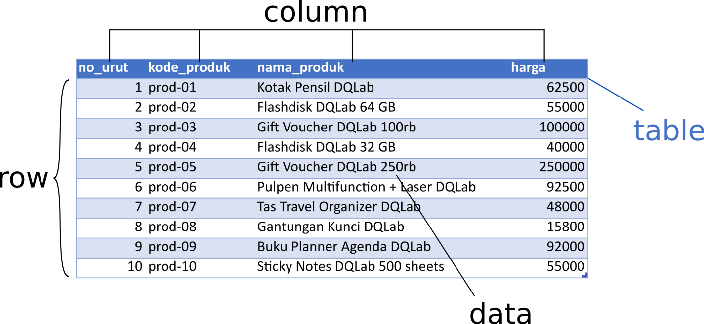

# Apa itu RDBMS?
**Relational Database Management System** yang biasa disingkat dengan RDMBS adalah suatu program yang memungkinkan untuk Membuat, Memperbarui, dan Mengelola suatu basis data relasional (Relational Database). Nah, Umumnya RDMBS ini menggunakan SQL untuk mengakses database.

Basis data relasional sendiri merupakan suatu jenis database dimana data – data umumnya disimpan dalam bentuk yang terstruktur berupa tabel (baris dan kolom) dan setiap tabel/ data yang terdapat dalam database memiliki relasi (relational) satu sama lain. Seperti terlihat pada gambar berikut

Basis data relasional sangat popular dan banyak digunakan oleh perusahaan – perusahaan karena jenis database ini mudah dikelola terlebih jika memiliki banyak data atau informasi yang perlu disimpan, scalable dan flexibel.

Basis data rasional cukup mudah dikelola. Setiap tabel/data dapat diupdate atau dimodifikasi tanpa mengganggu tabel/data yang lain.

Flexible : jika perlu memperbarui data, hanya perlu melakukannya sekali saja - jadi tidak perlu lagi mengubah banyak file satu per satu. Selain itu, basis data rasional juga cukup mudah untuk di-extend. Misalnya saat data sudah semakin banyak, dapat dengan mudah memperbesar kapasitas dari database yang dimiliki.

#### Produk-produk RDBMS di Pasaran
Selain MySQL, masih ada produk lain RDBMS, baik yang berbayar (proprietary) maupun open source. Berikut adalah sebagian produk yang cukup populer di pasaran :
- **MySQL** : Open-source SQL database yang cukup populer. Umumnya digunakan untuk pengembangan aplikasi web.
- **PostgreSQL** : Open-source RDBMS product, dan juga umumnya digunakan untuk pengembangan aplikasi web. Akan tetapi secara kinerja, postgreSQL lebih lambat dibandingkan MySQL.
- **Oracle DB** : Produk RDMS yang dimiliki oleh Oracle Corporation dan produk ini bersifat proprietary atau tidak open source. Oracle DB umumnya digunakan di industri perbankan.
- **Microsoft SQL Server** : SQL Server adalah produk RDBMS yang dimiliki oleh Microsoft dan sama seperti Oracle DB, SQL Server bersifat proprietary atau tidak open source, SQL Server umumnya digunakan di perusahaan skala besar yang juga menggunakan produk keluaran Microsoft lainnya.
- **SQLite** : Open source RDBMS, umumnya digunakan sebagai database di handphone, MP3 player, and perangkat lainnya.

Selain itu, juga ada MariaDB yang juga gratis atau open source, IBM DB2, Microsoft Access, dan masih banyak lainnya.

Umumnya RDBMS menggunakan SQL untuk mengakses database dan produk RDBMS tidak hanya satu macam saja tetapi ada berbagai macam produk, maka SQL syntax pun bisa jadi sedikit berbeda untuk setiap produk tersebut. Berikut contoh perbandingan MySQL, Oracle, dan SQLSERVER untuk menampilkan beberapa baris data dari suatu tabel :

### Struktur Penyimpanan RDBMS
Sebagai penyimpan data, sistem database relasional memiliki struktur hirarki objek penyimpanan sebagai berikut:
- Database
- Tabel (table)
- Kolom (column) atau Field

Dari sini aku belajar informasi menarik yaitu setiap database bisa berisi beberapa tabel, dan setiap tabel bisa terdiri dari beberapa kolom. Di setiap database, tabel dan kolom memiliki nama sendiri sebagai identitas mereka. Tabel dan kolom inilah yang akan diisi data yang kemudian membentuk row (baris data). 

#### Tabel dan Kolom
Gambar berikut adalah contoh suatu Tabel dalam database. Karena setiap tabel dalam database memiliki nama, maka, nama tabel ini adalah ms_produk.

Jika aku perhatikan, struktur tabel ms_produk terdiri dari empat kolom (column), masing-masing dengan nama berikut:

- no_urut
- kode_produk
- nama_produk
- harga

Dan dalam tabel tersebut terdapat 10 baris data (row) dengan isi data yang bervariasi, contoh isi data untuk kolom "nama_produk" pada baris kelima adalah "Gift Voucher DQLab 250rb".

## Kesimpulan
Wah ternyata seru sekali belajar SQL! 

Aku mulai membuka catataanku, mengambil pena, dan menuliskan apa yang aku pelajari:

1. Sistem relasional database atau relational database management system (RDBMS) adalah sistem database paling populer di dunia saat ini dan menggunakan bahasa SQL untuk pengolahannya.
2. Beberapa produk RDBMS yang terkenal antara lain adalah Microsoft SQL Server, Oracle, MySQL, PostgreSQL, IBM DB2, dan masih banyak lainnya.
3. Struktur penyimpanan data di RDBMS menggunakan hirarki:
   - Database
   - Tabel (Table)
   - Kolom (Column)
4. Data akan diisi ke dalam tabel dalam bentuk Baris (Row) data
