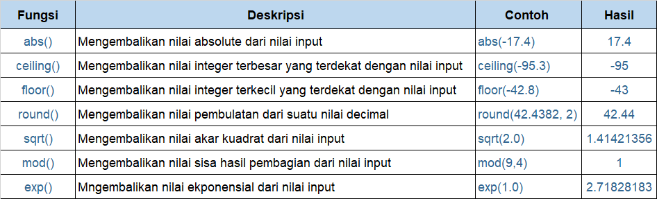
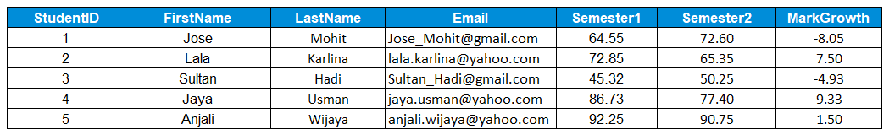

# Fungsi Scalar vs Fungsi Aggregate

Fungsi adalah metode yang digunakan untuk melakukan operasi data di database. Operasi ini bisa berupa kalkulasi numerik seperti **SUM**, **COUNT**, **AVG**, dan lain-lain; atau operasi non-numerik seperti string concatenations dan sub-strings. SQL Function dapat dibagi ke dalam 2 kategori, yaitu fungsi scalar dan fungsi aggregate.

Hm, apa aja sih bedanya fungsi skalar dan fungsi aggregate?

- **Fungsi skalar** dalam SQL digunakan untuk mengembalikan nilai tunggal (single value) dari suatu nilai input yang diberikan.
- **Fungsi agregat** dalam SQL digunakan untuk melakukan perhitungan pada sekelompok nilai dan kemudian mengembalikan nilai tunggal.

## Fungsi Skalar Matematika

Fungsi skalar pertama yang akan kita bahas adalah fungsi skalar untuk nilai numerik. Fungsi ini umumnya digunakan jika kita ingin melakukan operasi matematika di SQL secara cepat dan efektif. Di SQL sendiri ada banyak fungsi matematika.

Untuk mengecek fungsi-fungsi apa saja yang bisa dilakukan di SQL, kita bisa membuka dokumentasi fungsi SQL di sini: 
- [Dokumentasi PostgreSQL](https://www.postgresql.org/docs/9.5/functions-math.html) untuk PostgreSQL database 
- [Dokumentasi MySQL](https://dev.mysql.com/doc/refman/8.0/en/mathematical-functions.html) untuk MySQL database.

Nah, sebagai bahan praktik kamu agar lebih paham, kamu bisa coba beberapa fungsi saja yang umumnya digunakan seperti ini:

Untuk memudahkan pemahaman, aku diberikan tabel dummy berisi nilai siswa semester 1 dan 2 di suatu sekolah. Berikut contoh penggunaan fungsi skalar dengan menggunakan tabel dummy: 

#### Tabel: students

