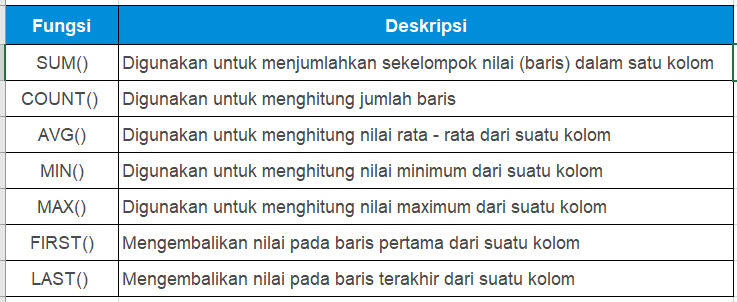

# Fungsi Aggregate

Seperti yang sudah dijelaskan, fungsi aggregate ini digunakan untuk melakukan perhitungan pada sekelompok nilai. Biar lebih jelas, kita akan mempraktikkan penggunaan fungsi aggregate di SQL dengan menggunakan fungsi-fungsi aggregate yang umum digunakan. Tapi sebelumnya, kamu simak saja dulu tabel fungsinya ini:


## Pengenalan GROUP BY

Kalau sudah ada datanya, kita pasti butuh mengelompokkannya dan menghitungnya berdasarkan penjualan setiap provinsi maupun dikelompokkan per bulan. Kalau kayak begitu kasusnya, pakai SQL bagaimana caranya ya?

Untuk mengelompokkan data di SQL, kita menggunakan **GROUP BY Statement**. **GROUP BY** statement akan mengelompokkan data yang bernilai sama ke dalam satu group, dan dengan menggunakan fungsi aggregate seperti **COUNT**, **MAX**, **MIN**, **SUM**, **AVG**, kita bisa melakukan agregasi untuk setiap group atau kelompok yang terbentuk.

Biar lebih jelas, coba pelajari penulisan syntax-nya:


### Hal penting yang perlu diperhatikan adalah:
- **GROUP BY** digunakan dengan **SELECT**, artinya kolom yang digunakan di **GROUP BY** statement, juga perlu ditempatkan di **SELECT**.
- **GROUP BY** ditempatkan setelah **WHERE**, tetapi jika tidak menggunakan **WHERE** maka langsung ditempatkan setelah **FROM**.
- Jika menggunakan **ORDER BY**, maka **GROUP BY** ditempatkan sebelum **ORDER BY**.

Apakah kita bisa menggunakan **GROUP BY** untuk mengelompokkan data menggunakan 2 kriteria atau 2 kolom? Tentu saja bisa. **GROUP BY** bisa dilakukan dengan single column ataupun multiple column. Seperti ini contohnya:
- **Group by Single Column**: Data dikelompokkan menggunakan kriteria dari satu kolom saja, misalnya mengelompokkan data berdasarkan provinsi saja.
- **Group by Multiple Column**: Data dikelompokkan menggunakan kriteria dari dua kolom atau lebih, misalnya mengelompokkan data berdasarkan province dan brand.

## Penggunaan CASE … WHEN….

Kalau aku diminta untuk menambahkan kolom rekomendasi atau remark dari hasil agregasi data, misalnya nilai penjualan bulan Maret 2019 lebih dari 30M, maka diberikan rekomendasi/remark “Target Achieved”, kalau kurang diberi remark “Follow Up”. Bagaimana melakukannya di SQL ya?

Itu mudah saja. Itu bisa kamu lakukan dengan **CASE** - statement di SQL. **CASE** - statement ini sama dengan **IF - THEN - ELSE** di pemrograman pada umumnya. Syntax dari **CASE** – statement seperti ini:


**CASE** - Statement ditempatkan sesudah **SELECT**, berikut syntax-nya secara lengkap:

```sql
SELECT ColumnName1, ColumnName2,  
CASE  
    WHEN condition1 THEN result1  
    WHEN condition2 THEN result2  
    WHEN conditionN THEN resultN  
    ELSE result  
END as alias  
FROM TableName;
```

**CASE-statement** akan mengevaluasi kondisi yang sudah ditentukan, dimulai dari **condition1**, dan akan mengembalikan hasil (**result1**), jika **condition1** terpenuhi (TRUE). Jika tidak, maka **condition2** akan dievaluasi, dan akan mengembalikan **result2** jika **condition2** terpenuhi, dst. Apabila tidak ada kondisi yang terpenuhi, maka **result** pada bagian **ELSE** yang akan dikembalikan.
