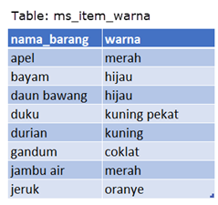
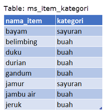
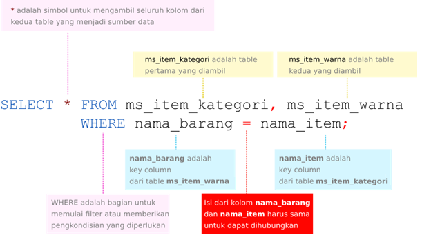
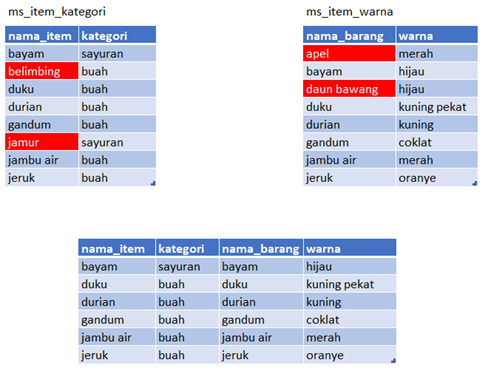
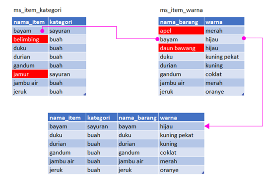

Tabel pertama: ms_item_warna
Oke, contoh tabel pertama yang akan kita gunakan sebagai bahan latihan adalah tabel ms_item_warna seperti terlihat berikut ini
01.png

Selanjutnya, jika permasalahan kita adalah ingin mengetahui informasi tidak hanya mengenai warna tetapi juga jenis/kategori dari setiap nama barang apakah tergolong sayuran atau buah, maka kita tidak dapat memperoleh informasi tersebut jika hanya berdasarkan tablel ms_item_warna. Oleh karena itu, kita perlu menghubungkan tabel tersebut dengan tabel lain yang berisi informasi tersebut, yaitu tabel ms_item_kategori.

Tabel kedua: ms_item_kategori
Kalau ini contoh tabel kedua, yakni tabel ms_item_kategori seperti terlihat berikut ini.
Nah, sekarang kita telah memiliki tabel kedua yaitu tabel ms_item_kategori yang memiliki delapan baris data dan berisi informasi mengenai nama tumbuhan dengan kategorinya. Sama seperti permasalahan di tabel sebelumnya, jika kita hanya memiliki tabel ms_item_kategori maka kita tidak dapat memperoleh informasi mengenai nama dan warna tumbuhan. Oleh karena itu, kita bisa menggabungkan kedua tabel tersebut menjadi satu tabel baru yang berisi informasi lengkap mengenai nama, warna dan kategori setiap barang/item.

Key Columns
Penjelasan selanjutnya adalah mengenai key columns dan bagaimana penggunaannya dalam menggabungkan kedua tabel.

Perhatikan kembali tabel ms_item_warna dan ms_item_kategori yang telah ditemui pada pembahasan sebelumnya.

Dari rangkaian pembahasan sebelumnya, dapat disimpulkan bahwa kedua tabel tersebut memiliki hubungan/relasi yaitu pada kolom nama_barang (tabel ms_item_warna) dan kolom nama_item (tabel ms_item_kategori) karena banyak kecocokan dari isi data.

Kedua kolom ini untuk selanjutnya disebut sebagai kolom kunci atau key columns.

Penjelasan Query Penggabungan Tabel
Penggabungan dua tabel menjadi satu tabel baru menggunakan query SELECT pada subbab sebelumnya dilakukan dengan cara berikut:
menuliskan dua nama tabel yang akan digunakan dengan dipisahkan operator koma (,).
menuliskan pasangan key columns dengan penghubung operator sama dengan (=) di bagian filter atau kondisi.

Berikut adalah gambaran detil syntax penggunaan cara di atas:

Cara join seperti ini disebut dengan cara join menggunakan operator koma.

Penjelasan Hasil Penggabungan Tabel
Penggabungan tabel menghasilkan enam baris data. Sedangkan di kedua tabel asal masing-masing memiliki delapan baris data. Lalu, kenapa bisa berkurang dua baris data?

Untuk menjawab pertanyaan tersebut, cobalah perhatikan gambar berikut:

Dua tabel di bagian atas yaitu tabel ms_item_kategori dan tabel ms_item_warna merupakan tabel sumber data, dan bagian bawah adalah tabel hasil penggabungan dari kedua tabel tersebut.

Dari tabel hasil penggabungan terlihat bahwa baris data yang muncul hanyalah baris data yang isi datanya terdapat di kedua key columns, dan data yang isinya cocok untuk kedua tabel jumlahnya hanya enam dari total delapan baris data yang ada. Sedangkan baris data yang berisi belimbing, jamur, apel dan daun bawang, tidak terdapat di kedua tabel, sehingga baris data ini akan di-exclude dan tidak akan muncul di tabel hasil penggabungan.

Penjelasan Proses Penggabungan Tabel
Mari diperhatikan kembali gambar di bawah ini untuk penjelasan proses penggabungan.

Panah berwarna magenta menunjukkan proses pencocokan dan penggabungan data. Sebagai contoh: Baris data pertama dengan isi “bayam” pada key column nama_item (tabel ms_item_kategori), akan mencari isi yang sama di key column nama_barang (tabel ms_item_warna), dan ditemukan pada baris kedua kemudian dihubungkan menjadi satu baris di tabel baru hasil penggabungan.

Pencocokan dengan pencarian ini berdasarkan bagian kondisi (conditional clause) pada query yang ditandai dengan warna kuning berikut.

Setelah seluruh data ditemukan dengan kondisi ini, dan jika tidak menentukan spesifik kolom maka seluruh kolom data dari kedua tabel akan dimunculkan dengan isi/baris data yang sama dan terdapat di kedua key column digabungkan menjadi satu baris pada tabel baru. 

Isi data yang ditandai dengan warna merah adalah data yang tidak memiliki pasangan sehingga tidak bisa digabungkan, dan dengan demikian tidak memiliki data gabungan pada hasil akhir.

Cara pencocokan dan penggabungan disebut dengan INNER JOIN - dimana isi dari key column kedua tabel harus cocok satu sama lain baru dapat digabungkan. 

Jika kamu biasa bekerja dengan Excel, proses ini hampir menyerupai penggunaan fungsi vlookup. Jadi harusnya sudah terbiasa.

Kesimpulan
Bahasa SQL diciptakan untuk sistem database relasional atau RDBMS. Dan aspek relasional inilah yang menjadi fitur paling penting dan unggul, dimana beberapa tabel dapat digabungkan menjadi satu sumber data baru.

Cara menggabungkan antar tabel disebut sebagai mekanisme join. Pada bab ini telah dicontohkan bagaimana dua tipe join, yaitu inner join dan cross join diterapkan dengan dua contoh tabel sederhana.

Inner join terjadi jika kedua tabel digabungkan melalui kolom kunci atau key column. Syarat penggabungan adalah dimana Isi data dari key column tabel yang satu harus dapat dicocokkan dengan isi data dari key column tabel yang lain.

Sedangkan cross join terjadi dari penggabungan tabel tanpa kondisi, dan menghasilkan seluruh penggabungan data seperti proses perkalian.

Untuk bab ini, inner join maupun cross join dilakukan dengan cara menggunakan operator koma dan pengkondisian where. Pada bab selanjutnya, akan terlihat penggunaan inner join dengan menggunakan keyword INNER JOIN … ON.