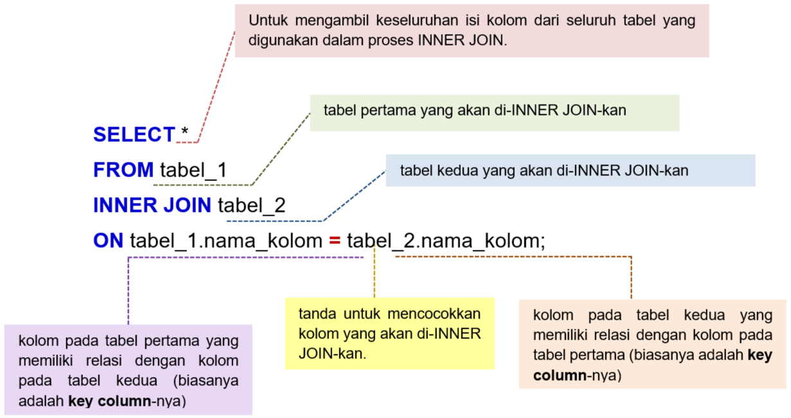
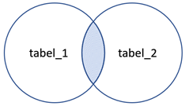
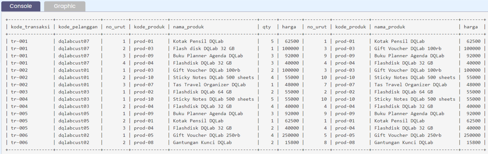
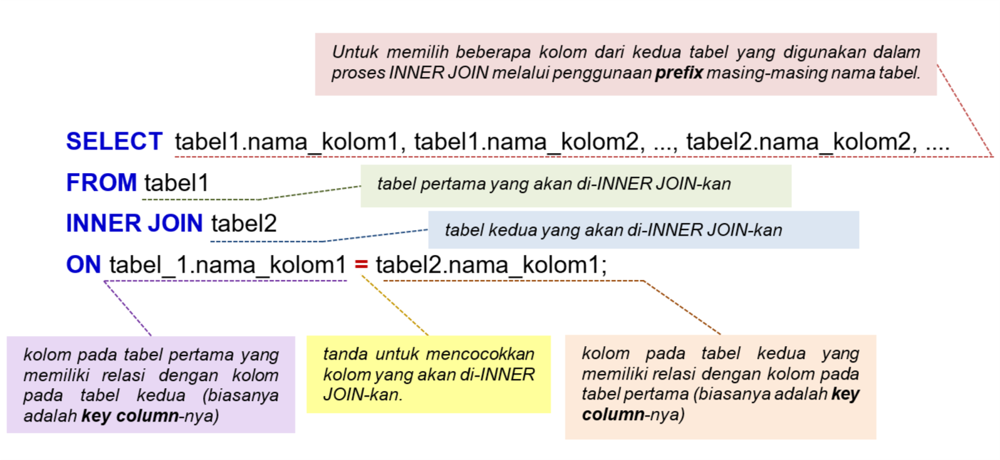

## Panduan Menggabungkan Tabel dengan INNER JOIN

Selanjutnya saya akan menjelaskan bagaimana menggabungkan dua tabel dengan metode INNER JOIN lain, yaitu dengan keyword INNER JOIN, yang memberikan hasil yang sama, tetapi dengan konstruksi atau syntax yang sedikit berbeda. Konstruksi baru ini akan memberi manfaat lebih ketika pada suatu query melibatkan beberapa join sehingga penggunaan operator koma menjadi sangat terbatas. Sampai sini sudah cukup pusing?

## Penjelasan Materi JOIN

Untuk penjelasan mengenai materi JOIN dengan penggunaan keyword INNER JOIN, kita akan kembali menggunakan dua contoh tabel sederhana, yaitu ms_item_warna dan ms_item_category, sehingga kita dapat dengan mudah memahami penggunaan keyword INNER JOIN untuk menggabungkan dua tabel tersebut. 

## Syntax INNER JOIN
Sudah tahu kan bahwa tujuan JOIN adalah menggabungkan dua atau lebih tabel yang berbeda di dalam database. Nah, JOIN ini hanya bisa dilakukan apabila tabel - tabel tersebut memiliki key kolom yang sama. Di SQL, terdapat beberapa tipe JOIN yaitu : 
- **INNER JOIN**
- **LEFT JOIN**
- **RIGHT JOIN**
- **FULL JOIN**
- **SELF JOIN**

Setiap tipe join memiliki tujuan dan hasil query yang berbeda. Pada metode INNER JOIN, baris dari kedua atau lebih tabel akan dibandingkan untuk mengecek baris - baris mana saja yang cocok satu sama lain berdasarkan kondisi JOIN yang ditentukan.

#### Syntax INNER JOIN:


Penggunaan prefix pada **tabel_1.nama_kolom** dan **tabel_2.nama_kolom** ditujukan agar terdapat kejelasan (clarity) kolom pada tabel mana yang dijadikan acuan dalam proses INNER JOIN. Tentunya, penggunaan prefix ini ini sangat bermanfaat jika ingin menggabungkan beberapa tabel. Untuk penjelasan lebih detail, coba ingat kembali penggunaan prefix dan alias, yang telah dipelajari pada modul "Fundamental SQL with SELECT statement chapter Prefix dan Alias.

Jika masing-masing tabel tersebut dianalogikan sebagai dua himpunan maka proses INNER JOIN ekivalen dengan INTERSECTION (IRISAN) antara dua himpunan.



Proses INNER JOIN memiliki konsep penggabungan untuk records pada kedua tabel yang bernilai sama.


## Memahami Proses dan Hasil Query dengan INNER JOIN

Perhatikan tabel hasil query pada tugas praktek sebelumnya, apakah perbedaan antara tabel sebelum penggabungan dengan INNER JOIN dan setelah penggabungan?



Sekarang seluruh kolom dari kedua tabel berada di satu tabel dan berisi seluruh kolom - kolom dari kedua tabel. Jadi, Aku juga dapat dengan mudah mengidentifikasi nama produk dari setiap kode produk yang dibeli oleh customer.

Sekarang perhatikan lebih lanjut dan bandingkan antara kolom **kode_produk** pada hasil query dengan INNER JOIN di atas, dengan kolom **kode_produk** pada tabel **ms_produk**. Menurutmu apa yang berbeda?

“Hm, aku tidak menemukan **prod-06** di tabel hasil query, padahal di tabel **ms_produk** terdapat data **prod-06** yaitu pulpen multifunction + laser DQLAB.”

Tepat sekali, selanjutnya bandingkan dengan tabel **tr_penjualan**, apakah kamu menemukan data **prod-06** di tabel tr_penjualan?

Tidak ada transaksi dengan kode_produksi **prod-06** di tabel **tr_penjualan**.   Sepertinya aku mulai paham. INNER JOIN akan mencocokkan key kolom tabel **tr_penjualan** dengan key kolom **ms_produk**, jika value dari key kolom sama - sama ada di kedua tabel , maka baris itu akan dikembalikan sebagai hasil query dan membentuk satu tabel yang berisi seluruh kolom dari kedua tabel, sedangkan jika value key kolom hanya terdapat di satu kolom, maka baris ini tidak akan ditampilkan. **prod-06** ada di tabel di **ms_produk** tetapi tidak ada di data penjualan sehingga saat penggabungan tabel dengan INNER JOIN, data **prod-06** dari tabel **ms_produk** tidak akan muncul di hasil query.

## Syntax INNER JOIN – Memilih Beberapa Kolom Untuk Ditampilkan

Sementara itu, jika kita ingin menampilkan beberapa kolom saja dari tabel hasil penggabungan, maka syntax SQL dari INNER JOIN dinyatakan sebagai berikut ini.



#### Bagian query
```sql
SELECT tabel1.nama_kolom1, tabel1.nama_kolom2, ..., tabel2.nama_kolom2, .... 
FROM tabel1
```
menghendaki pemilihan kolom mana saja dari kedua tabel yang akan digabungkan. Disini diperlukan penggunaan prefix nama tabelnya.

#### Selanjutnya, bagian query
```sql
INNER JOIN tabel2
```
digunakan untuk menggabungkan tabel1 dengan tabel2.

#### Akhirnya, bagian query
```sql
ON tabel_1.nama_kolom1 = tabel2.nama_kolom1;
```
adalah acuan penggabungan tabel1 dan tabel2 berdasarkan kolom yang memiliki tingkat kecocokan yang tinggi. Kedua kolom dengan tingkat kecocokan yang tinggi pada masing-masing tabel disebut juga dengan key column. 

_Catatan:_
Perlu diperhatikan jika menampilkan kolom dengan nama yang sama di kedua tabel, maka pada bagian Select, tidak bisa hanya mengetikkan nama kolom saja, tetapi juga harus didahului oleh prefix nama tabel dimana kolom itu berasal untuk menghindari error karena ambiguitas.

## Kesimpulan
Pada chapter INNER JOIN ini kita telah mempelajari bagaimana menggabungkan dua tabel berdasarkan key column-nya.
- Pada tahap awal kita menggunakan INNER JOIN untuk menggabungkan keseluruhan kolom yang dimiliki oleh kedua tabel tersebut. 
- Selanjutnya, kita menerapkan INNER JOIN dengan menggunakan prefix nama tabel untuk memilih kolom-kolom mana saja yang akan ditampilkan pada tabel hasil penggabungan.
Untuk chapter selanjutnya kita akan menggabungkan tabel dengan menggunakan UNION.